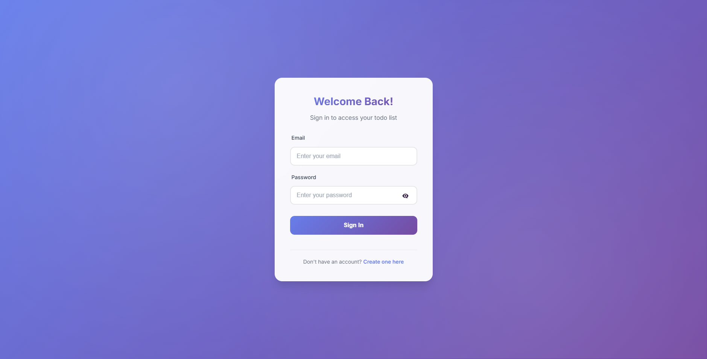
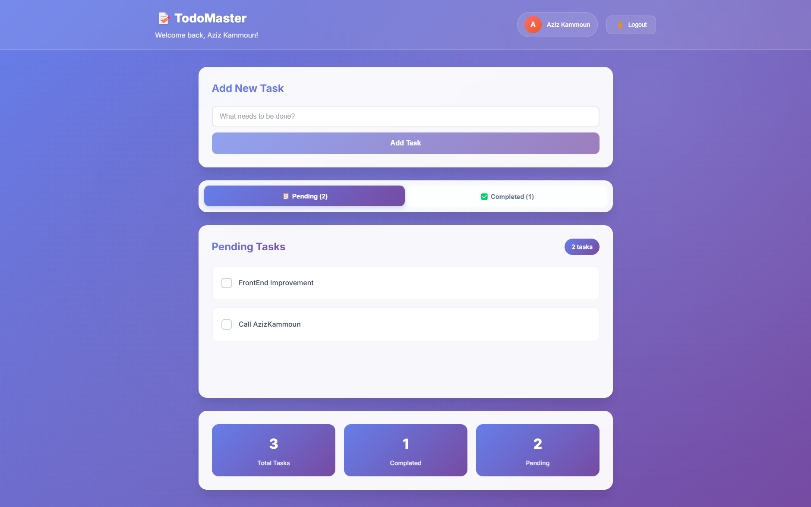

# 📋 TodoMaster - Advanced Todo Application with Authentication

A full-stack Todo application featuring robust authentication, secure task management, and modern web development practices. Built with Node.js, Express, and MongoDB with comprehensive security measures and a responsive React frontend interface.

## 🚀 Live Demo & Screenshots


_Clean, Register Login interface_


_Clean, intuitive dashboard interface_

## ✨ Key Features

### 🔐 Advanced Authentication System

- **Secure Registration**: Email validation, username uniqueness, and encrypted password storage
- **JWT Authentication**: Stateless authentication with refresh token support
- **Password Security**: bcrypt hashing with configurable salt rounds
- **Session Management**: Automatic token refresh and secure logout
- **Route Protection**: Middleware-based authorization for all protected endpoints

### 📝 Comprehensive Task Management

- **CRUD Operations**: Create, read, update, and delete tasks with full validation
- **User Isolation**: Complete data separation between user accounts
- **Task Categorization**: Organize tasks with custom categories and priorities
- **Real-time Updates**: Instant UI updates with optimistic rendering
- **Data Persistence**: Reliable MongoDB storage with proper indexing

### 🎨 Modern Frontend Experience

- **Responsive Design**: Mobile-first approach with adaptive layouts
- **Interactive UI**: Smooth animations and intuitive user interactions
- **Form Validation**: Client-side and server-side validation with user feedback
- **Error Handling**: Comprehensive error states and user-friendly messages
- **Loading States**: Professional loading indicators and skeleton screens

### 🔧 Developer Experience

- **Clean Architecture**: Well-organized codebase with separation of concerns
- **Middleware Chain**: Modular middleware for authentication, validation, and error handling
- **Environment Configuration**: Flexible configuration management
- **Input Validation**: Comprehensive Joi schemas for all endpoints
- **Error Logging**: Structured logging for debugging and monitoring

## 🏗️ Project Structure

```
TodoMaster/
├── backend/
│   ├── config/
│   │   └── DbConnection.js          # Database configuration
│   ├── middlewares/
│   │   ├── authVerification.js      # JWT authentication middleware
│   │   ├── DataVerification.js      # Input validation middleware
│   │   └── userValidation.js        # User-specific validations
│   ├── models/
│   │   ├── todoSchema.js            # Todo data model
│   │   └── user.js                  # User data model
│   ├── routes/
│   │   ├── addTask.js               # Task creation endpoint
│   │   ├── auth.js                  # Authentication routes
│   │   ├── delTask.js               # Task deletion endpoint
│   │   ├── editTask.js              # Task modification endpoint
│   │   └── showAll.js               # Task retrieval endpoint
│   ├── node_modules/                # Dependencies
│   ├── .gitignore                   # Git ignore rules
│   ├── index.js                     # Server entry point
│   ├── package-lock.json            # Dependency lock file
│   └── package.json                 # Project configuration
├── frontend/
│   ├── src/
│   │   ├── assets/                  # Static assets
│   │   ├── auth/
│   │   │   ├── auth.css            # Authentication styles
│   │   │   └── auth.jsx            # Authentication components
│   │   ├── home/
│   │   │   ├── home.css            # Home page styles
│   │   │   └── home.jsx            # Home page component
│   │   ├── App.css                 # Global styles
│   │   ├── App.jsx                 # Main application component
│   │   ├── index.css               # Base styles
│   │   └── main.jsx                # Application entry point
│   ├── public/                     # Public assets
│   ├── node_modules/               # Frontend dependencies
│   ├── .gitignore                  # Git ignore rules
│   ├── eslint.config.js            # ESLint configuration
│   ├── index.html                  # HTML template
│   ├── package-lock.json           # Dependency lock file
│   ├── package.json                # Frontend configuration
│   └── vite.config.js              # Vite build configuration
└── README.md                       # Project documentation
```

## 🛠️ Technology Stack

### Backend Technologies

| Technology     | Purpose                       | Version |
| -------------- | ----------------------------- | ------- |
| **Node.js**    | Runtime Environment           | 18+     |
| **Express.js** | Web Application Framework     | ^4.18.0 |
| **MongoDB**    | NoSQL Database                | ^6.0    |
| **Mongoose**   | Object Document Mapper        | ^7.0.0  |
| **JWT**        | Authentication Tokens         | ^9.0.0  |
| **bcrypt**     | Password Hashing              | ^5.1.0  |
| **Joi**        | Input Validation              | ^17.9.0 |
| **CORS**       | Cross-Origin Resource Sharing | ^2.8.0  |

### Frontend Technologies

| Technology | Purpose                 | Version |
| ---------- | ----------------------- | ------- |
| **React**  | UI Library              | ^18.0.0 |
| **Vite**   | Build Tool & Dev Server | ^4.0.0  |

## 🚀 Quick Start

### Prerequisites

- Node.js (v18 or higher)
- MongoDB (v6.0 or higher)
- npm or yarn package manager

### Installation

1. **Clone the repository**

   ```bash
   git clone https://github.com/AzizDevX/TodoMaster.git
   cd TodoMaster
   ```

2. **Backend Setup**

   ```bash
   cd backend
   npm install

   # Create environment file
   cp .env.example .env
   # Edit .env with your configuration
   ```

3. **Frontend Setup**

   ```bash
   cd ../frontend
   npm install
   ```

4. **Environment Configuration**

   ```bash
   # Backend .env file
   ConnectDb=mongodb://127.0.0.1:27017/TodoMaster
   JWT_SECRET=your-super-secret-jwt-key
   PORT=3001
   NODE_ENV=development
   ```

5. **Start the Application**

   ```bash
   # Terminal 1 - Backend
   cd backend
   npm start

   # Terminal 2 - Frontend
   cd frontend
   npm run dev
   ```

6. **Access the Application**
   - Frontend: http://localhost:3000
   - Backend API: http://localhost:3001

## 📚 API Documentation

> **Important**: All task-related endpoints require JWT authentication in the header.  
> Only Register and Login endpoints work with body data only.

### Authentication Endpoints

_These endpoints do not require Authorization header - only request body_

#### Register User

```http
POST /api/auth/register
Content-Type: application/json

{
  "Email": "21test@gmail.com",
  "UserName": "21Aziz2",
  "Password": "Aziz123"
}
```

#### Login User

```http
POST /api/auth/login
Content-Type: application/json

{
  "Email": "21test@gmail.com",
  "Password": "Aziz123"
}
```

### Task Management Endpoints

_All these endpoints require Authorization header with Bearer token_

#### Get All Tasks

```http
GET /api/tasks
Authorization: Bearer <jwt_token>
```

_Displays all tasks on the home page_

#### Create Task

```http
POST /api/tasks/create
Authorization: Bearer <jwt_token>
Content-Type: application/json

{
  "TaskName": "Complete project documentation"
}
```

#### Edit Task

```http
PUT /api/tasks/edit
Authorization: Bearer <jwt_token>
Content-Type: application/json

{
  "FindTask": "old task name",
  "NewName": "updated task name"
}
```

#### Delete Task

```http
DELETE /api/tasks/delete
Authorization: Bearer <jwt_token>
Content-Type: application/json

{
  "TaskName": "task to delete"
}
```

#### Mark Task as Completed

```http
PUT /api/tasks/complete
Authorization: Bearer <jwt_token>
Content-Type: application/json

{
  "FindTask": "task name to mark as completed"
}
```

## 🔒 Security Features

- **Password Hashing**: bcrypt with configurable salt rounds
- **JWT Authentication**: Secure token-based authentication
- **Input Validation**: Comprehensive Joi schema validation
- **CORS Configuration**: Controlled cross-origin access
- **Environment Variables**: Sensitive data protection
- **Rate Limiting**: API endpoint protection (recommended for production)
- **SQL Injection Prevention**: Mongoose ORM protection
- **XSS Protection**: Input sanitization

## 🧪 Testing

```bash
# Backend tests
cd backend
npm start

# Frontend tests
cd frontend
npm run dev
```

## 📈 Performance Optimizations

- **Database Indexing**: Optimized MongoDB queries
- **Middleware Caching**: Efficient request processing
- **Frontend Bundling**: Vite optimization
- **Lazy Loading**: Component-based code splitting
- **API Response Compression**: Reduced payload sizes

## 🤝 Contributing

1. Fork the repository
2. Create a feature branch (`git checkout -b feature/amazing-feature`)
3. Commit your changes (`git commit -m 'Add amazing feature'`)
4. Push to the branch (`git push origin feature/amazing-feature`)
5. Open a Pull Request

## 📄 License

This project is licensed under the MIT License - see the [LICENSE](LICENSE) file for details.

## 👥 Authors

- **Aziz Kammoun** - _Full Stack Developer_ - [AzizDevX](https://github.com/AzizDevX)
- Email: azizkammoun1919@gmail.com

## 🙏 Acknowledgments

- MongoDB team for excellent documentation
- Express.js community for middleware examples
- React team for comprehensive guides
- JWT.io for authentication insights

## 📞 Support

For support, email azizkammoun1919@gmail.com or visit the [GitHub repository](https://github.com/AzizDevX/TodoMaster).

---

⭐ **Star this repository if you found it helpful!**
